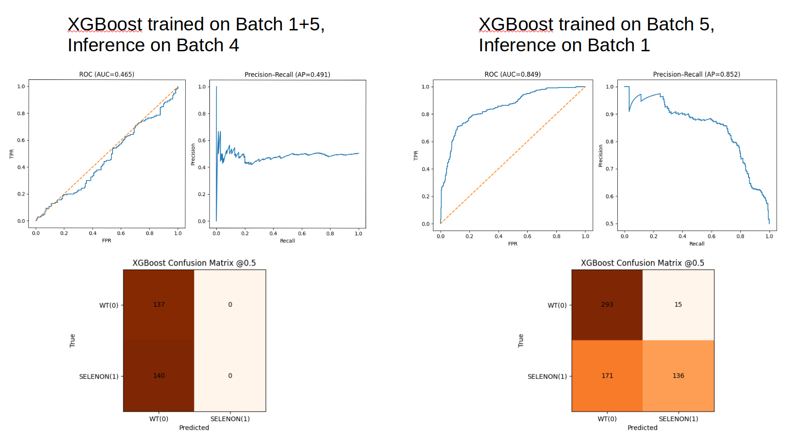

## 01-14-2026

- Implemented XGBoost cross-batch training, testing, inferencing
- Separated ftt and xgb scripts into their own directories
- Set up configs and outputs to track inference and training separately

### Findings

- Cross-batch inferencing is terrible across cell lines (expected as discussed with Pamela)
- Cross-batch inferencing within a cell line is not terrible but not great either

In order to train a model and have it inference on a different batch dataset, the training and inference datasets have to be transformed to have the same common features. If the training dataset contains features that don't exist in the inference dataset, then those features have to be dropped. Likewise for the inference dataset as compared to the training dataset. This ensures that the training dataset and the inference dataset have the same common set of features. The model can then be trained on the transformed training dataset and inference on the inference dataset. 

I think dropping so many features to ensure a common set contributes to this poor performance. Also need to double check if I did the transformation correctly.

### TODO
- [ ] Double check the `align_datasets()` function logic
- [ ] Combine `train_cross_batch.py` and `train.py` into one script for xgboost
- [ ] Create a general inference script for xgboost
- [ ] Have config be able to link to other configs so you don't have to keep copying model arch and training settings
- [ ] Replicate cross-batch training infrastructure for ftt
- [ ] Implement feature masking for ftt so it can handle NaN values that show up when combining tables from different batches